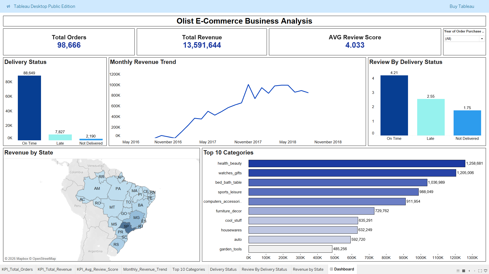

# Olist E-Commerce Business Analysis

## Project Overview

This project analyzes the Olist Brazilian e-commerce dataset to understand sales performance, customer reviews, delivery performance, product categories, payment methods, sellers, and state-wise revenue.

The project follows a complete data analytics workflow using Python for exploratory data analysis, MySQL for data preparation and business queries, and Tableau Public for interactive visualization.

## Tools & Technologies

- Python
- Pandas
- NumPy
- Matplotlib
- MySQL
- Tableau Public
- Jupyter Notebook
- Git & GitHub

## Business Objectives

- Analyze overall sales and revenue performance
- Identify top-performing product categories
- Compare delivery performance across orders
- Understand the relationship between delivery time and customer reviews
- Analyze revenue across Brazilian states
- Examine payment methods and seller performance

## Project Workflow

1. Data Understanding & Exploratory Data Analysis using Python
2. Data Loading and Business Analysis using MySQL
3. Tableau dataset preparation using SQL
4. Interactive dashboard development using Tableau Public
5. Business insights and visualization

## Dataset

The project uses the Olist Brazilian E-Commerce Public Dataset, containing information about:

- Customers
- Orders
- Order items
- Products
- Sellers
- Payments
- Reviews
- Geolocation
- Product categories

## Python EDA

Python was used for data understanding, cleaning, exploratory analysis, and visualization.

Key analysis areas included:

- Data types and missing values
- Order and customer analysis
- Product category performance
- Seller performance
- Revenue analysis
- Delivery time analysis
- Review score analysis
- Payment method analysis

## MySQL Analysis

MySQL was used to load the dataset, create the database tables, validate table relationships, and perform business-focused SQL analysis.

The analysis included:

- Data validation and table joins
- Revenue and order analysis
- Monthly revenue and order trends
- Top product categories
- Customer state analysis
- Repeat customer analysis
- Payment method and installment analysis
- Seller performance
- Delivery performance
- Review score analysis
- Delivery performance versus customer reviews
- Month-over-month revenue growth
- Product category ranking

## Tableau Dashboard

Tableau Public was used to create an interactive dashboard to present the key business findings.

The dashboard includes:

- Total Orders
- Total Revenue
- Average Review Score
- Monthly Revenue Trend
- Top 10 Product Categories
- Delivery Status
- Review Score by Delivery Status
- Revenue by Brazilian State

## Dashboard Preview

📊 **[View Interactive Tableau Dashboard](https://public.tableau.com/views/Olist_Ecommerce_Dashboard_17888764945020/Dashboard?:language=en-US&publish=yes)**

## Key Findings

- On-time deliveries received substantially higher average review scores than late deliveries.
- Beauty & Health was among the highest-revenue product categories.
- Credit cards were the most frequently used payment method.
- São Paulo generated the highest state-level revenue.
- Delivery performance had a noticeable relationship with customer satisfaction.

## Project Files

- Python EDA: `python/`
- MySQL Analysis: `sql/`
- Tableau Dashboard: `tableau/`
- Dashboard Screenshot: `images/`
